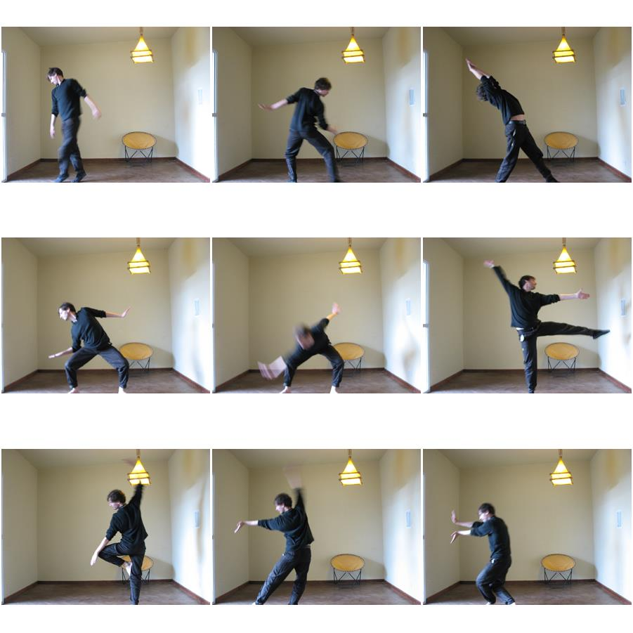

# Photo Booth [WIP]

Photo Booth sketch in p5.js, using typescript.

You can get the original p5.js sketch from _/prototype_ folder. 

## Screenshot

## Requirements

You must have node installed

## Install

`npm install`

## Build

`npm run build` or `npm run build:dev` for hot reloading.

## Run server

`node server.js`

Then, go to `localhost:3000`

## Usage

Allow camera access.

Click screen.

9 photos will be taken.

Capture will prompt to download.
